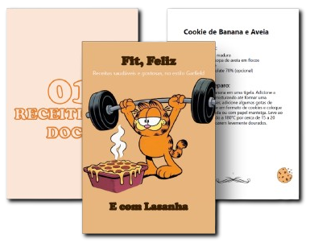

    

-------

# Projeto EBOOK Gerado por I.A.s

Projeto com o objetivo de gerar um ebook digital com as facilidades das ferramentas de IA. todos os prompts
seguem abaixo.

<a href="https://github.com/palomacanton/prompts-recipe-to-create-a-ebook/blob/main/output/Ebook%20-%20Fit%2C%20Feliz%20E%20com%20Lasanha.prn" title="View PDF now"> 📕Clique aqui para ler</a>

## 💻 Tecnologias utilizadas no projeto

- [ChatGPT](https://chat.openai.com/) 
- [Ideogram](https://ideogram.ai/)
- [Bing Image](https://www.bing.com/images/create)
- [PowerPoint](https://www.microsoft.com/en/microsoft-365/powerpoint)
- [Remover fundo de imagem](https://www.remove.bg/pt-br)
- [Canva](https://www.canva.com/)

## 🧠 Prompts

ChatGPT：

|   Ação   | prompt                                                                                                                                                                                                                                                                         |
| :------: | ------------------------------------------------------------------------------------------------------------------------------------------------------------------------------------------------------------------------------------------------------------------------------ |
|  título  | Crie um título de um ebook sobre o tema de alimentação, o ebook é do nicho de nutrição e o subnicho é emagrecimento, o título deve ser épico e curto, e tenha uma temática do garfield no título, me liste 5 variações de títulos                                              |
| conteúdo | Faça um texto para ebook, com foco em em receitinhas fit que normalmente são calóricas e gostosas, listando os ingredientes e modo de preparo{REGRAS} > Explique sempre de uma maneira simples> Deixe o texto enxuto                                                           |

Ideogram：

|  Ação  | prompt                                                                                 |
| :----: | -------------------------------------------------------------------------------------- |
| título | Faça o garfield treinando na academia com uma lasanha do lado, em estilo de desenho dos quadrinhos |

## ✨ Features

- Conteúdo gerado via ChatGPT
- Imagens geradas via Ideogram e Bing

## 📚 Materiais

- Imagens utilizadas em `assets`
- ebook gerado durante as aulas em `output`

## 🛠️ Instruções de execução

Utilize os prompts acima nas ferramentas sugeridas para gerar o material base e utilize uma ferramenta de edição de documentos como power point, libreoffice , indesign para diagramação.

    
    
&nbsp&nbsp&nbspPaloma Canton 
    &nbsp&nbsp&nbsp
    <a href="https://github.com/palomacanton">
    GitHub</a>&nbsp;|&nbsp;
    <a href="www.linkedin.com/in/palomacanton">LinkedIn</a>

